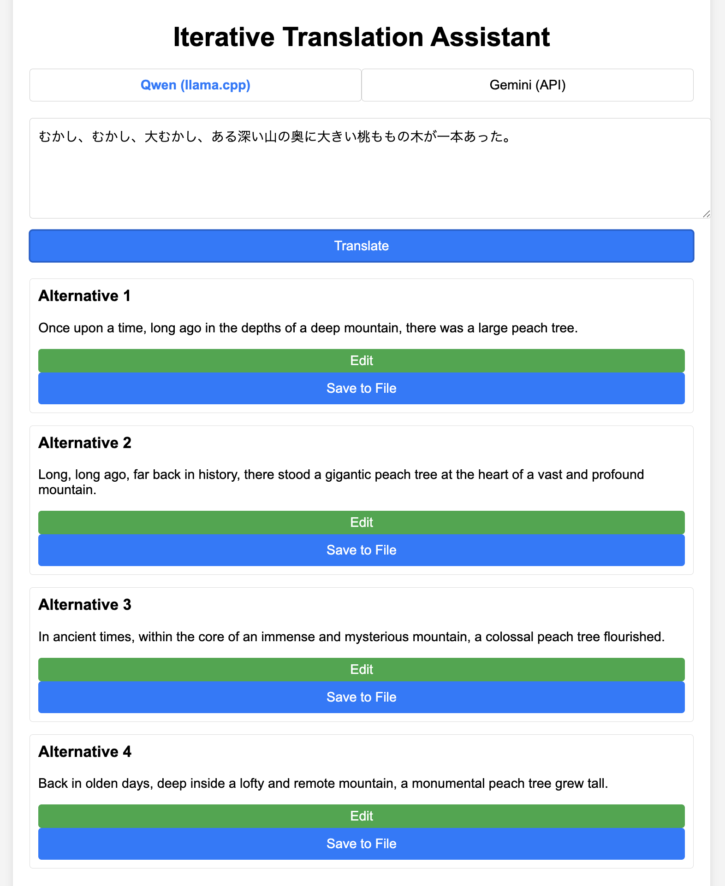

# Iterative Translation Assistant (Flask Edition)

<!-- Updated README with more concise structure and placeholders for screenshots -->
## Overview

The Iterative Translation Assistant is a web-based tool with a Python/Flask backend, designed to assist in translating sentences using a Language Model (LLM). It presents four translation alternatives, highlights differences, and allows iterative learning by saving accepted translations in the browser's `localStorage`.

## Features

- **Web Interface**: Built with HTML, CSS, and JavaScript.
- **Flask Backend**: Handles translation requests.
- **Sentence Input**: Field for entering the original sentence.
- **LLM Communication**: Generates 4 translation alternatives.
- **Difference Highlighting**: Visual differences between alternatives.
- **Direct Editing**: Edit button for each alternative.
- **Local Persistence**: Saved translations in `localStorage`.
- **Continuous Improvement**: Uses saved translations for contextualized prompts.

## File Structure

- `app.py`: Main Flask application, routes, and backend logic.
- `llm.py`: Contains the `LLM` class with the `completion` method.
- `templates/index.html`: Main HTML structure.
- `static/css/style.css`: Styles for the UI.
- `static/js/script.js`: Client-side JavaScript logic.
- `static/js/utils.js`: Utility functions (difference highlighting, localStorage).
- `requirements.txt`: Python dependencies.
- `.gitignore`: Ignores unnecessary files.
- `README.md`: This file.

## How to Use

### Prerequisites

- Python 3.x installed.
- An `llm.py` file in the project root with your `LLM` class and `completion` method.

### Setup

1. Clone the repository.
2. Create and activate a virtual environment:
   ```bash
   python -m venv venv
   source venv/bin/activate  # On Windows: venv\Scripts\activate
   ```
3. Install dependencies:
   ```bash
   pip install -r requirements.txt
   ```
4. Ensure your `llm.py` is correctly configured (API keys, model paths, etc.).

### Run the Application

```bash
flask run
# Or python app.py (if __main__ is configured)
```

5. Open your browser and navigate to `http://127.0.0.1:5000/`.
6. Enter the sentence you want to translate.
7. Analyze the 4 alternatives and edit them as needed.

## Technologies

- **Backend**: Python, Flask
- **Frontend**: HTML, CSS, JavaScript (Vanilla JS)
- **Communication**: AJAX (`fetch` API)
- **LLM Interface**: Your `llm.py` file
- **Context Storage**: Browser `localStorage`.
- **Difference Highlighting**: JavaScript

## Future Improvements

- Support for multiple source/target languages.
- Export/import saved translations.
- Configure LLM parameters via the UI.
- User authentication to save translations server-side.
- Enhanced error handling.

## Screenshots


